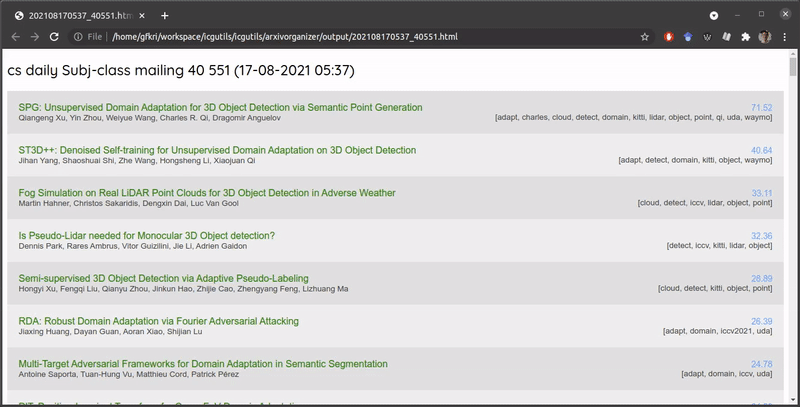

# arXiv Organizer



arXiv Organizer is a tool designed to help you sort and organize papers on arXiv based on specified keywords. It can fetch paper lists from newsletters (via IMAP) or open access paper lists from conferences such as CVPR, ICCV, WACV, and more. The resulting website contains the paper sorted by relevance to the specified keywords.

## Features

- Sort papers based on keywords
- Fetch paper lists from newsletters, while ignoring already read newsletter.
- Fetch paper lists from open access conference paper lists

## Installation

To install the required dependencies, run:

```bash
pip install -r requirements.txt
```

## Configuration

Configure the tool by editing the `config.py` file to set your desired keywords and other settings.

## Usage

Run the organizer using:

```bash
python organizer.py
```

The tool generates a website with organized paper lists based on your keywords in the `output` folder. If multiple newsletter are processed it creates one website for each newsletter and one combining all non-read ones. 

Additionally, `utils/analysis_utils.py` provides tools for analyzing data from CVF Open Access and similar conference proceeding websites.

